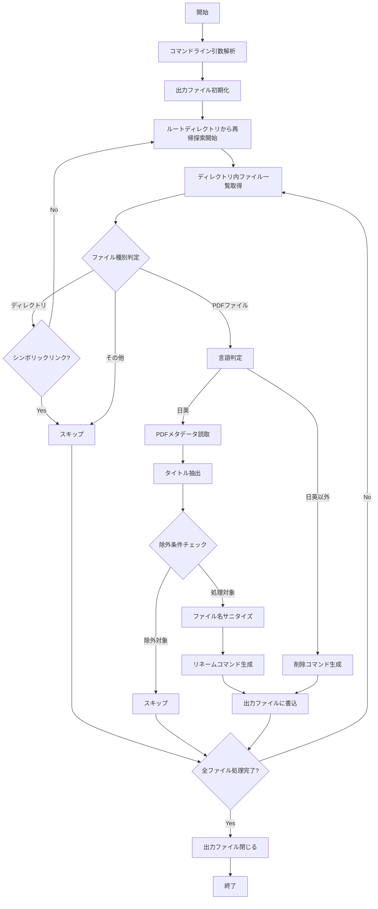

# 設計文書

## 概要

PDF リネーミングツールは、Apache PDFBox ライブラリを使用してPDFファイルのメタデータからタイトル情報を抽出し、ファイル名を自動的に変更するGroovy CLIアプリケーションです。ツールは2段階のアプローチを採用しており、まず分析フェーズでリネーム操作を含むGroovyスクリプトを生成し、次に実行フェーズでそのスクリプトを実行してファイルをリネームします。

## アーキテクチャ

### システム構成

```
PDF リネーミングツール
├── generatePDFRenameIt.groovy (メインスクリプト)
├── renamePDFs.groovy (生成される実行スクリプト)
└── 依存ライブラリ
    └── Apache PDFBox 2.0.29
```

### 処理フロー



## コンポーネントと インターフェース

### 1. メインスクリプト (generatePDFRenameIt.groovy)

**責任:**
- コマンドライン引数の解析
- ディレクトリの再帰的探索
- PDFファイルの処理とメタデータ抽出
- リネームスクリプトの生成

**主要関数:**

#### `sanitizeFileName(String name)`
- **目的:** Windowsファイルシステムで無効な文字を置換
- **入力:** 元のファイル名文字列
- **出力:** サニタイズされたファイル名文字列
- **処理:** `[\\/:*?"<>|]` パターンを `_` に置換

#### `isNonJapaneseEnglish(String name)`
- **目的:** ファイル名が日本語・英語以外かを判定
- **入力:** ファイル名文字列
- **出力:** boolean（true=日英以外、false=日英）
- **処理:** Unicode文字ブロック判定を使用

#### `tripleQuote(String str)`
- **目的:** 文字列を三重引用符で囲む
- **入力:** 文字列
- **出力:** 三重引用符で囲まれた文字列
- **処理:** `"""` + str + `"""`

#### `getWriter(String path, String encoding)`
- **目的:** 指定された文字エンコーディングでファイルライターを作成
- **入力:** ファイルパス、文字エンコーディング
- **出力:** OutputStreamWriter
- **処理:** UTF-8/Shift-JIS/EUC-JP対応

#### `processDir(File dir, writer)`
- **目的:** ディレクトリを再帰的に処理
- **入力:** ディレクトリオブジェクト、ファイルライター
- **出力:** なし（副作用として出力ファイルに書込）
- **処理:** 
  - ディレクトリ内ファイル一覧取得
  - シンボリックリンクのスキップ
  - PDFファイルの識別と処理
  - サブディレクトリの再帰処理

### 2. 生成スクリプト (renamePDFs.groovy)

**責任:**
- 実際のファイルリネーム操作の実行
- 操作結果の表示

**構造:**
- Java NIO Files.move() を使用したリネーム操作
- 各操作の進行状況表示

## データモデル

### PDFファイル情報
```groovy
class PDFFileInfo {
    String originalPath      // 元のファイルパス
    String title            // PDFタイトルプロパティ
    String sanitizedTitle   // サニタイズ後のタイトル
    String newPath          // 新しいファイルパス
    boolean shouldRename    // リネーム対象かどうか
    String excludeReason    // 除外理由（除外の場合）
}
```

### 処理結果
```groovy
class ProcessingResult {
    int totalFiles          // 処理対象ファイル総数
    int renamedFiles        // リネーム対象ファイル数
    int excludedFiles       // 除外ファイル数
    int deletedFiles        // 削除対象ファイル数
    List<String> errors     // エラーメッセージリスト
}
```

## エラーハンドリング

### 1. ディレクトリアクセスエラー
- **発生条件:** アクセス権限不足、存在しないディレクトリ
- **処理:** エラーメッセージ表示後、処理継続
- **メッセージ:** "アクセス不可: {ディレクトリパス}"

### 2. PDFファイル読み込みエラー
- **発生条件:** 破損したPDF、パスワード保護PDF
- **処理:** エラーメッセージ表示後、次のファイルに進む
- **メッセージ:** "PDF処理失敗: {ファイルパス} - {エラー詳細}"

### 3. ファイル書き込みエラー
- **発生条件:** 出力ファイルへの書き込み権限不足
- **処理:** 例外をスローして処理終了
- **対策:** 事前に書き込み権限を確認

### 4. 文字エンコーディングエラー
- **発生条件:** 指定された文字エンコーディングが無効
- **処理:** デフォルトのUTF-8にフォールバック
- **メッセージ:** エンコーディング情報を表示

## テスト戦略

### 1. 単体テスト

#### ファイル名サニタイズテスト
```groovy
// テストケース
assert sanitizeFileName("test:file") == "test_file"
assert sanitizeFileName('test"file') == "test_file"
assert sanitizeFileName("test<>file") == "test__file"
```

#### 言語判定テスト
```groovy
// テストケース
assert isNonJapaneseEnglish("test.pdf") == false
assert isNonJapaneseEnglish("テスト.pdf") == false
assert isNonJapaneseEnglish("тест.pdf") == true
```

#### 除外条件テスト
```groovy
// テストケース
assert shouldExclude("_private.pdf") == true
assert shouldExclude("~temp.pdf") == true
assert shouldExclude("Untitled.pdf") == true
assert shouldExclude("") == true
assert shouldExclude("normal.pdf") == false
```

### 2. 統合テスト

#### ディレクトリ構造テスト
- 複数階層のディレクトリ構造での動作確認
- シンボリックリンクの適切なスキップ確認
- アクセス権限のないディレクトリでの継続処理確認

#### PDFファイル処理テスト
- 正常なPDFファイルのタイトル抽出確認
- 破損したPDFファイルでのエラーハンドリング確認
- パスワード保護PDFでのスキップ確認

#### 出力スクリプト生成テスト
- 生成されたGroovyスクリプトの構文正確性確認
- 三重引用符でのパス囲み確認
- 文字エンコーディング対応確認

### 3. エンドツーエンドテスト

#### 実際のファイルリネームテスト
- テスト用PDFファイルセットでの完全な処理フロー確認
- 生成されたスクリプトの実行確認
- リネーム結果の検証

## セキュリティ考慮事項

### 1. ファイルシステムアクセス
- 読み取り専用での初期スキャン
- 書き込み操作は生成されたスクリプトでのみ実行
- パス traversal 攻撃の防止

### 2. 入力検証
- ファイル名の長さ制限チェック
- 無効文字の適切なサニタイズ
- コマンドライン引数の検証

### 3. 権限管理
- 最小権限の原則に従った実行
- 管理者権限不要での動作
- ファイル操作前の権限確認

## パフォーマンス考慮事項

### 1. メモリ使用量
- PDFファイルのストリーミング処理
- 大量ファイル処理時のメモリ効率化
- ガベージコレクション最適化

### 2. 処理速度
- 並列処理の検討（将来的な拡張）
- ファイルI/O最適化
- 不要なファイル読み込みの回避

### 3. スケーラビリティ
- 大規模ディレクトリ構造での動作保証
- 進行状況表示による応答性向上
- 中断・再開機能の検討（将来的な拡張）